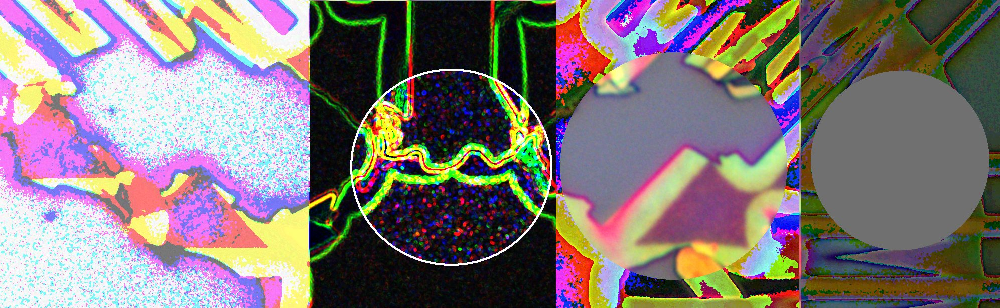

<!--
[]
-->
 
](https://github.com/anuraghazra/github-readme-stats)

<!---

- 👋 Hi, I’m @Schmuckstuck
- 👀 I’m interested in ...
- 🌱 I’m currently learning ...
- 💞️ I’m looking to collaborate on ...
- 📫 How to reach me ...
-->
<!---
Schmuckstuck/Schmuckstuck is a ✨ special ✨ repository because its `README.md` (this file) appears on your GitHub profile.
You can click the Preview link to take a look at your changes.
--->
